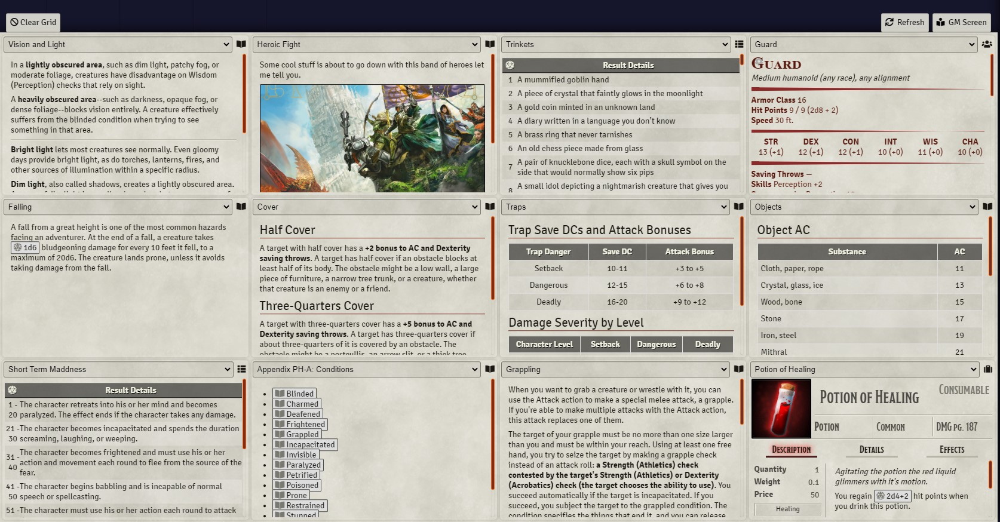

# GM Screen


[](https://www.foundryvtt-hub.com/package/gm-screen/)
[](https://www.foundryvtt-hub.com/package/gm-screen/)


[](https://ko-fi.com/elffriend)
[](https://www.patreon.com/ElfFriend_DnD)


Creates a Configurable modular grid that GMs can populate with journal entries, rollable tables, actors, and items. Customize your "GM Screen" by dragging and dropping items into cells and have its information available at any time from a button on the bottom right of the UI, near the sidebar. Roll rollable tables, open linked entities, and even place actor sheets into these cells. Obviously the space constraints mean some sheets will work better than others.

## TODO
- [x] disable setting active grid ID for non-gm users
- [] fix memory leak in render() not cleaning up old applications
- [x] create a static method on GM Screen Application to tell if there are gm screen tabs that the active user can see, this might should be a helper actually
- [] add the button to player UIs if there is a shared gm screen tab in non-drawer mode
- [x] Auto refresh when gmScreenConfig changes
- [x] as part of refresh, check if there are any shared grids, if not, close/open the drawer
- [] Create a placeholder for the grid if there are no tabs, hide the button if no tabs and we are player
- [x] in Drawer mode, fully hide the drawer with css for players who have no tabs
- [] in non-drawer mode, close the application on refresh if there are no longer any tabs
- [] Change the scope of some settings to be client scope instead of world scoped
- [] ~~change gm screen `.close()` to behave appropriately for the user type~~ nvm, changing strat
- [] refactor `activateListeners` to not inject html, instead use `_renderHtml()`.
- [x] refactor the gm screen api to live in the `modules.get(gm-screen).api` place.

## Usage

- Drag and Drop Journal Entries, Rollable Tables, even Actors and Items into cells on the GM Screen.
- Alternatively use the select menus (not recommended).
- Each cell has settings which allow for that cell to span multiple columns or rows.
- Clicking the little icon on the top-right of the cell will pop out the full sized sheet for whatever entity is in the cell. The GM Screen is intended to be read-only, so edits to things inside it will happen for the most part by popping the entity out.

## Installation

Module JSON:

```
https://github.com/ElfFriend-DnD/foundryvtt-gmScreen/releases/latest/download/module.json
```

## Screenshots



## Configuration

| **Name**                      | Default | Description                                                                                                                                                                                         |
| ----------------------------- | :-----: | --------------------------------------------------------------------------------------------------------------------------------------------------------------------------------------------------- |
| **Grid Tabs**                 |  Menu   | Allows the user to configure multiple tabs of the grid. Each grid tab created can have its own Column Override and Row Override if the default setting isn't what you want for that particular tab. |
| **Columns**                   |    4    | Sets the number of columns in the grid.                                                                                                                                                             |
| **Rows**                      |    3    | Sets the number of rows in the grid.                                                                                                                                                                |
| **Display as Drawer**         |  true   | Controls whether the GM Screen appears as a normal popup dialog or as a drawer. To use the PopOut module with the GM Screen, this needs to checked.                                                 |
| Drawer Only: **Right Margin** |  0(vw)  | Sets the offest from the sidebar to the right side of the GM Screen. This number affects the maximum possible width of the screen.                                                                  |
| Drawer Only: **Height**       | 60(vh)  | Sets the height of the GM Screen Drawer.                                                                                                                                                            |
| Drawer Only: **Width**        | 100(%)  | Calculated as a percentage of the available screen width after the sidebar and right margin are taken into account.                                                                                 |
| Drawer Only: **Opacity**      | 100(%)  | Controls how opaque the drawer is.                                                                                                                                                                  |
| **Reset Grid**                |  false  | Saving with this checkbox checked will reset the grid (useful if you end up somehow causing it to fail to render).                                                                                  |

Note that changing the grid dimensions after populating the grid might cause unexpected results, and odds are you will have to clear the grid and repopulate things.

## Compatibility

I'm honestly not sure how well this will play with modules that make changes to how journal articles or roll tables interact.

| **Name**                                                               |       Works        | Notes                                            |
| ---------------------------------------------------------------------- | :----------------: | ------------------------------------------------ |
| [OneJournal](https://gitlab.com/fvtt-modules-lab/one-journal)          | :heavy_check_mark: | Works as expected.                               |
| [MEME](https://github.com/Moerill/fvtt-markdown-editor)                | :heavy_check_mark: | Markdown Renders as expected.                    |
| [Inline Webviewer](https://github.com/ardittristan/VTTInlineWebviewer) | :heavy_check_mark: | Jounrnal entries with webviews work as expected. |

## API

After the hook `gmScreenReady` is fired, the following api methods are expected to be on `window['gm-screen']`:
### `toggleGmScreenVisibility(isOpen: boolean)`

Opens or Closes the GM Screen. By default will toggle the current state.

```js
window['gm-screen'].toggleGmScreenVisibility(false); // always closes
window['gm-screen'].toggleGmScreenVisibility(true); // always opens
window['gm-screen'].toggleGmScreenVisibility(); // always toggles
```


### `Hooks.callAll('gmScreenOpenClose', cb)`

This hook is called when the GM Screen Opens of Closes with the following as the callback:

```ts
(app: Application, options: {isOpen: true}) => void
```

## Known Issues

- The grid does not refresh automatically when settings are changed, click the "refresh" button.
- It is possible to overlap your cells with column/row spanning. It should not be possible to make it so you cannot recover from such a situation manually.

## Acknowledgements

Bootstrapped with Nick East's [create-foundry-project](https://gitlab.com/foundry-projects/foundry-pc/create-foundry-project).

Mad props to the [League of Extraordinary FoundryVTT Developers](https://forums.forge-vtt.com/c/package-development/11) community which helped me figure out a lot.
