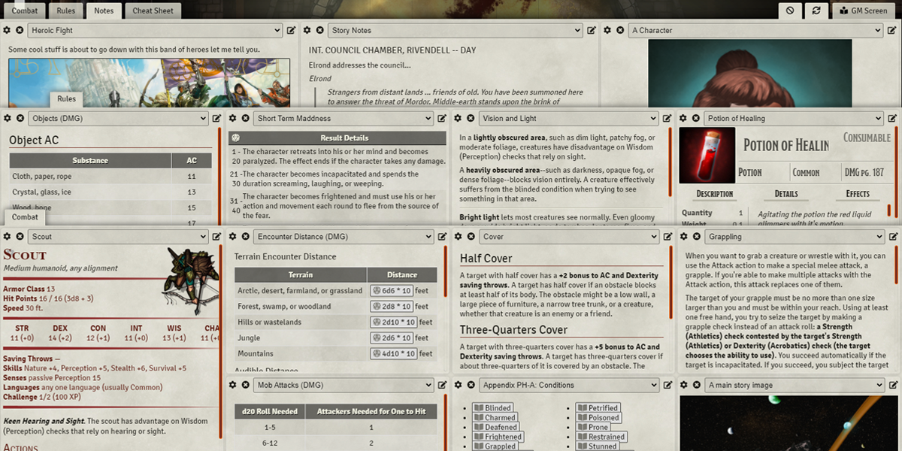
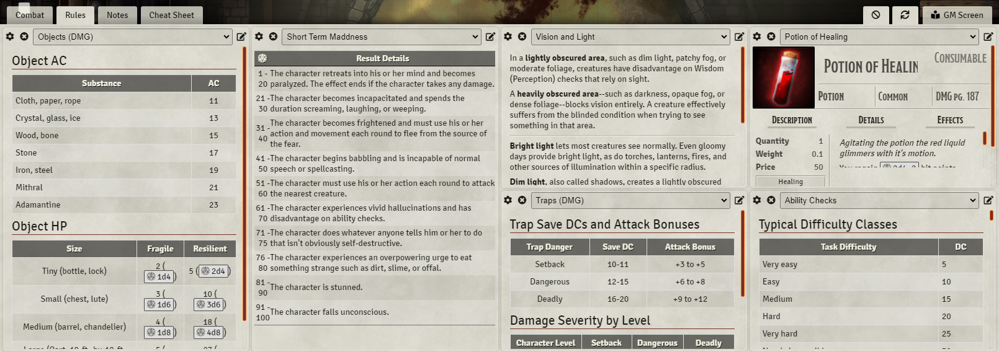
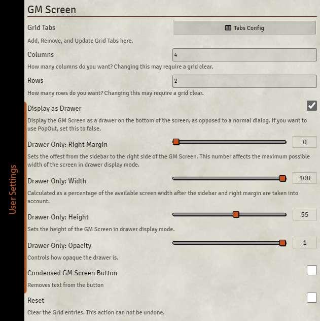

# GM Screen
<!-- ALL-CONTRIBUTORS-BADGE:START - Do not remove or modify this section -->
[](#contributors-)
<!-- ALL-CONTRIBUTORS-BADGE:END -->


[](https://www.foundryvtt-hub.com/package/gm-screen/)
[](https://www.foundryvtt-hub.com/package/gm-screen/)


[](https://ko-fi.com/elffriend)
[](https://www.patreon.com/ElfFriend_DnD)



Creates a tabbed modular grid that GMs can populate with journal entries, rollable tables, actors, and items. Customize your "GM Screen" by dragging and dropping items into cells and have its information available at any time from a button on the bottom right of the UI, near the sidebar. Roll rollable tables, open linked entities, and even place actor sheets into these cells. Obviously the space constraints mean some sheets will work better than others.

Additionally, any screen you create as GM can be set to be shared with players, so you can provide them with a cheat sheet that is always readily available to them. Be sure you set the permissions correctly on the entities themselves before trying to share them with players on a screen!

## Usage


- Set up tabs in the Module Settings, and optionally share some with your players.
- Drag and Drop Journal Entries, Rollable Tables, even Actors and Items into cells on the GM Screen.
- Alternatively use the select menus (not recommended).
- Each cell has settings which allow for that cell to span multiple columns or rows.
- Clicking the little icon on the top-right of the cell will pop out the full sized sheet for whatever entity is in the cell. The GM Screen is intended to be read-only, so edits to things inside it will happen for the most part by popping the entity out.

## Installation

Module JSON:

```
https://github.com/ElfFriend-DnD/foundryvtt-gmScreen/releases/latest/download/module.json
```

## Screenshots

### GM View




### Player View (with a tab set to be shared)


## Configuration



| **Name**                       | Scope  | Default | Description                                                                                                                                                                                         |
| ------------------------------ | :----: | :-----: | --------------------------------------------------------------------------------------------------------------------------------------------------------------------------------------------------- |
| **Grid Tabs**                  | world  |  Menu   | Allows the user to configure multiple tabs of the grid. Each grid tab created can have its own Column Override and Row Override if the default setting isn't what you want for that particular tab. |
| **Columns**                    | world  |    4    | Sets the number of columns in the grid.                                                                                                                                                             |
| **Rows**                       | world  |    3    | Sets the number of rows in the grid.                                                                                                                                                                |
| **Display as Drawer**          | client |  true   | Controls whether the GM Screen appears as a normal popup dialog or as a drawer. To use the PopOut module with the GM Screen, this needs to checked.                                                 |
| Drawer Only: **Right Margin**  | client |  0(vw)  | Sets the offset from the sidebar to the right side of the GM Screen. This number affects the maximum possible width of the screen.                                                                  |
| Drawer Only: **Height**        | client | 60(vh)  | Sets the height of the GM Screen Drawer.                                                                                                                                                            |
| Drawer Only: **Width**         | client | 100(%)  | Calculated as a percentage of the available screen width after the sidebar and right margin are taken into account.                                                                                 |
| Drawer Only: **Opacity**       | client | 100(%)  | Controls how opaque the drawer is.                                                                                                                                                                  |
| **Condensed GM Screen Button** | client |  false  | Removes the text from the GM Screen Button.                                                                                                                                                         |
| **Reset Grid**                 | world  |  false  | Saving with this checkbox checked will reset the grid (useful if you end up somehow causing it to fail to render).                                                                                  |

Note that changing the grid dimensions after populating the grid might cause unexpected results, and odds are you will have to clear the grid and repopulate things.

### Tab Configuration


| **Name**             | Description                                                                                                                          |
| -------------------- | ------------------------------------------------------------------------------------------------------------------------------------ |
| **Tab Label**        | The name of this tab, this is visible to players if the tab is shared.                                                               |
| **Columns Override** | Override the number of columns in this specific grid tab.                                                                            |
| **Rows Override**    | Override the number of rows in this specific grid tab.                                                                               |
| **Shared**           | Controls whether or not this tab is also visible to players. If there are no shared grids, the players do not see the Screen at all. |
| **Delete**           | Removes a Tab.                                                                                                                       |

There is no current way to reorder tabs once created.

### Entity Sheet Configuration

It is possible to select a specific sheet for use when an Entity is rendered in the GM Screen which the same entity will not use during normal usage. The best example of this would be to use a specifically designed compact sheet for GM Screen view, but have the normal sheet for usual usage.


## Compatibility

I'm honestly not sure how well this will play with modules that make changes to how journal articles or roll tables interact.

| **Name**                                                                        |       Works        | Notes                                                    |
| ------------------------------------------------------------------------------- | :----------------: | -------------------------------------------------------- |
| [OneJournal](https://gitlab.com/fvtt-modules-lab/one-journal)                   | :heavy_check_mark: | Works as expected.                                       |
| [MEME](https://github.com/Moerill/fvtt-markdown-editor)                         | :heavy_check_mark: | Markdown Renders as expected.                            |
| [Inline Webviewer](https://github.com/ardittristan/VTTInlineWebviewer)          | :heavy_check_mark: | Journal entries with webviews work as expected.          |
| [Kanka-Foundry](https://github.com/eXaminator/kanka-foundry)                    | :heavy_check_mark: | Journal entries are displayed as expected.               |
| [Monk's Enhanced Journal](https://github.com/ironmonk88/monks-enhanced-journal) |        :x:         | Not compatible.                                          |
| [PDF Foundry](https://github.com/Djphoenix719/PDFoundry)                        |        :x:         | Currently not possible to embed pdfs into the GM Screen. |

## API

After the hook `gmScreenReady` is fired, the following api methods are expected to be on `window['gm-screen']`:
### `toggleGmScreenVisibility(isOpen: boolean)`

Opens or Closes the GM Screen. By default will toggle the current state.

```js
window['gm-screen'].toggleGmScreenVisibility(false); // always closes
window['gm-screen'].toggleGmScreenVisibility(true); // always opens
window['gm-screen'].toggleGmScreenVisibility(); // always toggles
```


### `Hooks.callAll('gmScreenOpenClose', cb)`

This hook is called when the GM Screen Opens of Closes with the following as the callback:

```ts
(app: Application, options: {isOpen: true}) => void
```

## Known Issues

- The grid does not refresh automatically when settings are changed, click the "refresh" button.
- The titles of cells do not refresh automatically when the entity is renamed.
- Some information will appear to players if they are shared a screen that contains things they do not have permission to view normally.
- It is possible to overlap your cells with column/row spanning. It should not be possible to make it so you cannot recover from such a situation manually.

## Acknowledgements

Bootstrapped with Nick East's [create-foundry-project](https://gitlab.com/foundry-projects/foundry-pc/create-foundry-project).

Mad props to the [League of Extraordinary FoundryVTT Developers](https://forums.forge-vtt.com/c/package-development/11) community which helped me figure out a lot.

## Contributors ✨

Thanks goes to these wonderful people ([emoji key](https://allcontributors.org/docs/en/emoji-key)):

<!-- ALL-CONTRIBUTORS-LIST:START - Do not remove or modify this section -->
<!-- prettier-ignore-start -->
<!-- markdownlint-disable -->
<table>
  <tr>
    <td align="center"><a href="https://github.com/saif-ellafi"><br /><sub><b>Saif Addin</b></sub></a><br /><a href="https://github.com/ElfFriend-DnD/foundryvtt-gmScreen/commits?author=saif-ellafi" title="Code">💻</a></td>
    <td align="center"><a href="http://lordzeel.com"><br /><sub><b>zeel</b></sub></a><br /><a href="https://github.com/ElfFriend-DnD/foundryvtt-gmScreen/commits?author=zeel01" title="Code">💻</a></td>
    <td align="center"><a href="https://github.com/Git-GoR"><br /><sub><b>Git-GoR</b></sub></a><br /><a href="#translation-Git-GoR" title="Translation">🌍</a></td>
    <td align="center"><a href="https://github.com/lozalojo"><br /><sub><b>José E. Lozano</b></sub></a><br /><a href="#translation-lozalojo" title="Translation">🌍</a></td>
    <td align="center"><a href="https://github.com/CarnVanBeck"><br /><sub><b>CarnVanBeck</b></sub></a><br /><a href="#translation-CarnVanBeck" title="Translation">🌍</a></td>
  </tr>
</table>

<!-- markdownlint-restore -->
<!-- prettier-ignore-end -->

<!-- ALL-CONTRIBUTORS-LIST:END -->

This project follows the [all-contributors](https://github.com/all-contributors/all-contributors) specification. Contributions of any kind welcome!
